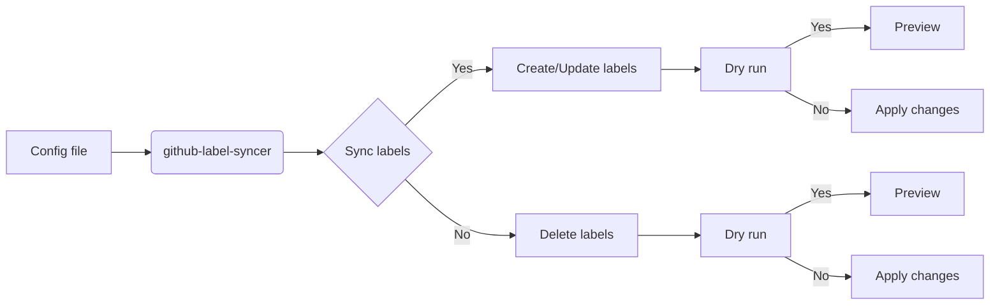
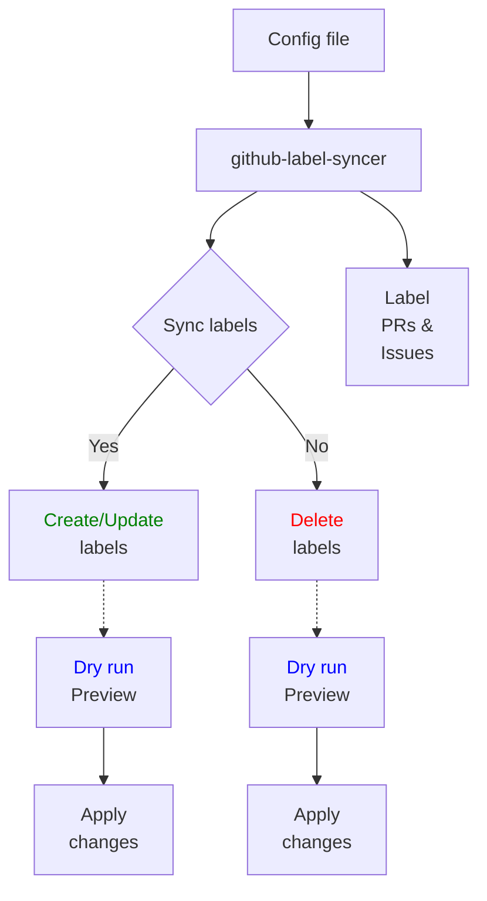

<h1 align="center" style="border-bottom: none">
    <b>
        <a href="https://docker.nsddd.top">github-label-syncer</a><br>
    </b>
</h1>
<h3 align="center" style="border-bottom: none">
      ⭐️  sync labels between repos and org.  ⭐️ <br>
<h3>


<p align=center>
<a href="https://goreportcard.com/report/github.com/kubecub/github-label-syncer"></a>
<a href="https://github.com/kubecub/github-label-syncer/issues?q=is%3Aissue+is%3Aopen+sort%3Aupdated-desc+label%3A%22good+first+issue%22"></a>
<a href="https://github.com/kubecub/github-label-syncer"></a>
<a href="https://join.slack.com/t/kubecub/shared_invite/zt-1se0k2bae-lkYzz0_T~BYh3rjkvlcUqQ"></a>
<a href="https://github.com/kubecub/github-label-syncer/blob/main/LICENSE"></a>
<a href="https://golang.org/"></a>
</p>

</p>

<p align="center">
    <a href="./README.md"><b>English</b></a> •
    <a href="./README_zh-CN.md"><b>中文</b></a>
</p>

</p>

----

## 🧩 Awesome features

This document discusses the development of a Go language actions that synchronizes labels on GitHub repositories. This actions is not limited to synchronizing labels on your own repository, but can also retrieve all of the API objects of a target repository, which can then be saved to a YAML file or synchronized to your own GitHub project.

Labels are an important way of organizing and categorizing issues and pull requests on GitHub. They allow you to quickly and easily identify the status, priority, and type of each issue or pull request.

To retrieve the API objects of a GitHub project's labels, you can use the following URLs:

- To retrieve the first page of objects: `https://api.github.com/repos/<owner>/<repo>/labels?page=1&sort=name-asc`
- To retrieve all objects: `https://api.github.com/repos/<owner>/<repo>/labels?per_page=100&page=1&sort=name-asc`

Simply replace `<owner>` and `<repo>` with the owner and repository name, respectively. These URLs can be used to retrieve all of the labels associated with a project, which can then be synchronized or saved as needed.

github-label-syncer is a tool to sync labels between repos and org. The main features are:

- [x]  Feel free to pick a remote repository and fetch all its labels to a local `yaml`, `table` AND `json`
- [x]  Feel free to pick a remote repository and sync all of its labels to your desired project repository
- [x]  Sync labels across repositories according to configuration 
- [x]  Create, update and delete labels 
- [x]  Dry run to preview which labels would be created, updated or deleted 
- [x]  Handle label collisions by renaming or skipping existing labels 
- [x]  Support labeling pull requests and issues


**Labels denger:**
The labels are designed semantic and standard. We provide labels for priority, type, status etc. You can refer to the [label doc](https://github.com/kubecub/github-label-syncer/labels) to get more info.

**github actions


## 🛫 Quick start

> **Note**: You can get started quickly with github-label-syncer.


<details>
  <summary>Work with Makefile</summary>

```bash
❯ make help    # show help
❯ make build   # build binary exporter and syncer
❯ echo 'export PATH=$PATH:/path/to/_output/platforms/linux/amd64/' | tee -a ~/.zshrc;source ~/.zshrc

```

</details>
<details>
  <summary>Work with actions</summary>

Actions provide handling of PR and issue.
We used the bot [🚀@kubbot](https://github.com/kubbot), It can detect issues in Chinese and translate them to English, and you can interact with it using the command `/comment`.

Comment in an issue:

```bash
❯ /intive
```

</details>
<details>
  <summary>Use</summary>

```bash
❯ ./_output/platforms/linux/amd64/exporter --help
usage: exporter [<flags>] <owner> <repo>


Flags:
      --[no-]help   Show context-sensitive help (also try --help-long and --help-man).
  -y, --[no-]yaml   Use the YAML format.
  -j, --[no-]json   Use the JSON format.
  -t, --[no-]table  Use the table format.

Args:
  <owner>  Owner of the repository.
  <repo>   Repository whose wanted labels.

❯ export GITHUB_TOKEN="ghp_****************************************0z"
❯ exporter kubecub log --json | jq
[
  {
    "name": "major version",
    "description": "Automatically create a new major version tag after PR is merged",
    "color": "1E8DE7"
  },
  {
    "name": "merge when passing",
    "description": "Merge the PR automatically once all status checks have passed",
    "color": "FF851B"
  },
  {
    "name": "minor version",
    "description": "Automatically create a new minor version tag after PR is merged",
    "color": "6EBAF7"
  },
  {
    "name": "patch version",
    "description": "Automatically create a new patch version tag after PR is merged",
    "color": "99cef9"
  }
]

❯ ./syncer --help
```

</details>
<details>
  <summary>Work with Docker</summary>

```bash
❯ make deploy
```

</details>


## 🕋 architecture diagram


**MVC Architecture Design:**


## 🤖 File Directory Description

Catalog standardization design structure:

```bash
.github-label-syncer
├── CONTRIBUTING.md          # Contribution guidelines
├── LICENSE                  # License information
├── Makefile                 # Makefile for building and running the project
├── README.md                # Project overview in English
├── README_zh-CN.md          # Project overview in Chinese
├── api                      # API-related files
│   ├── OWNERS               # API owners
│   └── README.md            # API documentation
├── assets                   # Static assets, such as images and stylesheets
│   └── README.md            # Assets documentation
├── build                    # Build-related files
│   ├── OWNERS               # Build owners
│   └── README.md            # Build documentation
├── cmd                      # Command-line tools and entry points
│   ├── OWNERS               # Command owners
│   └── README.md            # Command documentation
├── configs                  # Configuration files
│   ├── OWNERS               # Configuration owners
│   ├── README.md            # Configuration documentation
│   └── config.yaml          # Main configuration file
├── deploy                   # Deployment-related files
│   ├── OWNERS               # Deployment owners
│   └── README.md            # Deployment documentation
├── docs                     # Project documentation
│   ├── OWNERS               # Documentation owners
│   └── README.md            # Documentation index
├── examples                 # Example code and usage
│   ├── OWNERS               # Example owners
│   └── README.md            # Example documentation
├── init                     # Initialization files
│   ├── OWNERS               # Initialization owners
│   └── README.md            # Initialization documentation
├── internal                 # Internal application code
│   ├── OWNERS               # Internal code owners
│   ├── README.md            # Internal code documentation
│   ├── app                  # Application logic
│   ├── pkg                  # Internal packages
│   └── utils                # Utility functions and helpers
├── pkg                      # Public packages and libraries
│   ├── OWNERS               # Package owners
│   ├── README.md            # Package documentation
│   ├── common               # Common utilities and helpers
│   ├── log                  # Log utilities
│   ├── tools                # Tooling and scripts
│   ├── utils                # General utility functions
│   └── version              # Version information
├── scripts                  # Scripts for development and automation
│   ├── LICENSE_TEMPLATES    # License templates
│   ├── OWNERS               # Script owners
│   ├── README.md            # Script documentation
│   ├── githooks             # Git hooks for development
│   └── make-rules           # Makefile rules and scripts
├── test                     # Test files and test-related utilities
│   ├── OWNERS               # Test owners
│   └── README.md            # Test documentation
├── third_party              # Third-party dependencies and libraries
│   └── README.md            # Third-party documentation
├── tools                    # Tooling and utilities for development
│   └── README.md            # Tool documentation
└── web                      # Web-related files, such as HTML and CSS
    ├── OWNERS               # Web owners
    └── README.md            # Web documentation
```

## 🗓️ community meeting

We welcome everyone to join us and contribute to github-label-syncer, whether you are new to open source or professional. We are committed to promoting an open source culture, so we offer community members neighborhood prizes and reward money in recognition of their contributions. We believe that by working together, we can build a strong community and make valuable open source tools and resources available to more people. So if you are interested in github-label-syncer, please join our community and start contributing your ideas and skills!

We take notes of each [biweekly meeting](https://github.com/kubecub/github-label-syncer/issues/2) in [GitHub discussions](https://github.com/kubecub/github-label-syncer/discussions/categories/meeting), and our minutes are written in [Google Docs](https://docs.google.com/document/d/1nx8MDpuG74NASx081JcCpxPgDITNTpIIos0DS6Vr9GU/edit?usp=sharing).

github-label-syncer maintains a [public roadmap](https://github.com/kubecub/community/tree/main/roadmaps). It gives a a high-level view of the main priorities for the project, the maturity of different features and projects, and how to influence the project direction.

## 🤼‍ Contributing & Development

kubecub Our goal is to build a top-level open source community. We have a set of standards, in the [Community repository](https://github.com/kubecub/community).

If you'd like to contribute to this github-label-syncer repository, please read our [contributor documentation](https://github.com/kubecub/github-label-syncer/blob/main/CONTRIBUTING.md).

Before you start, please make sure your changes are in demand. The best for that is to create a [new discussion](https://github.com/kubecub/github-label-syncer/discussions/new/choose) OR [Slack Communication](https://join.slack.com/t/kubecub/shared_invite/zt-1se0k2bae-lkYzz0_T~BYh3rjkvlcUqQ), or if you find an issue, [report it](https://github.com/kubecub/github-label-syncer/issues/new/choose) first.


## 🚨 License

Kubecub is licensed under the MIT License, Version 2.0. See [LICENSE](https://github.com/kubecub/github-label-syncer/tree/main/LICENSE) for the full license text.

[](https://app.fossa.com/projects/git%2Bgithub.com%2Fkubecub%2Fgithub-label-syncer?ref=badge_large)


## 🔮 Thanks to our contributors!

<a href="https://github.com/kubecub/github-label-syncer/graphs/contributors">
  
</a>
