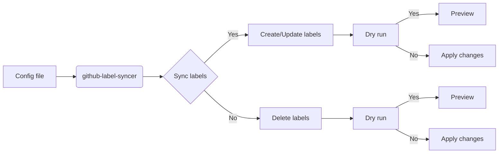
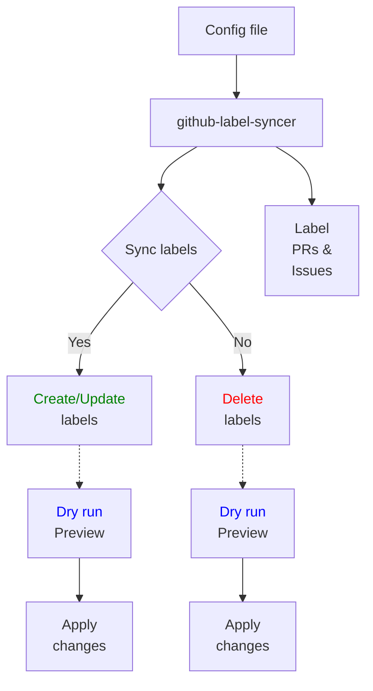

<h1 align="center" style="border-bottom: none">
    <b>
        <a href="https://docker.nsddd.top">github-label-syncer</a><br>
    </b>
</h1>
<h3 align="center" style="border-bottom: none">
      ⭐️  sync labels between repos and org.  ⭐️ <br>
<h3>


<p align=center>
<a href="https://goreportcard.com/report/github.com/kubecub/github-label-syncer"></a>
<a href="https://github.com/kubecub/github-label-syncer/issues?q=is%3Aissue+is%3Aopen+sort%3Aupdated-desc+label%3A%22good+first+issue%22"></a>
<a href="https://github.com/kubecub/github-label-syncer"></a>
<a href="https://join.slack.com/t/kubecub/shared_invite/zt-1se0k2bae-lkYzz0_T~BYh3rjkvlcUqQ"></a>
<a href="https://github.com/kubecub/github-label-syncer/blob/main/LICENSE"></a>
<a href="https://golang.org/"></a>
</p>

</p>

<p align="center">
    <a href="./README.md"><b>English</b></a> •
    <a href="./README_zh-CN.md"><b>中文</b></a>
</p>

</p>

----

## 🧩 Awesome features

This document discusses the development of a Go language actions that synchronizes labels on GitHub repositories. This actions is not limited to synchronizing labels on your own repository, but can also retrieve all of the API objects of a target repository, which can then be saved to a YAML file or synchronized to your own GitHub project.

Labels are an important way of organizing and categorizing issues and pull requests on GitHub. They allow you to quickly and easily identify the status, priority, and type of each issue or pull request.

To retrieve the API objects of a GitHub project's labels, you can use the following URLs:

- To retrieve the first page of objects: `https://api.github.com/repos/<owner>/<repo>/labels?page=1&sort=name-asc`
- To retrieve all objects: `https://api.github.com/repos/<owner>/<repo>/labels?per_page=100&page=1&sort=name-asc`

Simply replace `<owner>` and `<repo>` with the owner and repository name, respectively. These URLs can be used to retrieve all of the labels associated with a project, which can then be synchronized or saved as needed.

github-label-syncer is a tool to sync labels between repos and org. The main features are:

- [x]  Feel free to pick a remote repository and fetch all its labels to a local `yaml`, `table` AND `json`
- [x]  Feel free to pick a remote repository and sync all of its labels to your desired project repository
- [x]  Sync labels across repositories according to configuration 
- [x]  Create, update and delete labels 
- [x]  Dry run to preview which labels would be created, updated or deleted 
- [x]  Handle label collisions by renaming or skipping existing labels 
- [x]  Support labeling pull requests and issues


**Labels denger:**
The labels are designed semantic and standard. We provide labels for priority, type, status etc. You can refer to the [label doc](https://github.com/kubecub/github-label-syncer/labels) to get more info.

**github actions


## 🛫 Quick start

> **Note**: You can get started quickly with github-label-syncer.

### 📦 Installation

```bash
git clone https://github.com/kubecub/github-label-syncer/release syncer && export syncer=$(pwd)/syncer && cd $syncer && make
```

**Install from github release**

Install from [GitHub Releases](https://github.com/kubecub/github-label-syncer/release)


#### Work with Makefile

```bash
❯ make help    # show help
❯ make build   # build binary exporter and syncer
❯ echo 'export PATH=$PATH:/path/to/_output/platforms/linux/amd64/' | tee -a ~/.zshrc;source ~/.zshrc
```


#### Use Github-Label-Syncer

You can set your own `GITHUB_TOKEN` via env or via the `export GITHUB_TOKEN` environment variable, or use one of the default tokens we provide, which is `TOEKN` for our free automated [🤖 robot](https://github.com/kubbot)

```bash
❯ ./_output/bin/platforms/linux/amd64/exporter --help
usage: exporter [<flags>] <owner> <repo>


Flags:
      --[no-]help    Show context-sensitive help (also try --help-long and --help-man).
  -y, --[no-]yaml    Use the YAML format.
  -j, --[no-]json    Use the JSON format.
  -t, --[no-]table   Use the table format.
  -x, --[no-]xml     Use the XML format.
      --[no-]toml    Use the TOML format.
      --[no-]ini     Use the INI format.
      --[no-]csv     Use the CSV format.
  -f, --file=FILE    Export labels to file.
      --token=TOKEN  GitHub token. ($GITHUB_TOKEN)

Args:
  <owner>  Owner of the repository.
  <repo>   Repository whose wanted labels.

❯ export GITHUB_TOKEN="ghp_****************************************0z"
❯ exporter kubecub log --json | jq
[
  {
    "name": "major version",
    "description": "Automatically create a new major version tag after PR is merged",
    "color": "1E8DE7"
  },
  {
    "name": "merge when passing",
    "description": "Merge the PR automatically once all status checks have passed",
    "color": "FF851B"
  },
  {
    "name": "minor version",
    "description": "Automatically create a new minor version tag after PR is merged",
    "color": "6EBAF7"
  },
  {
    "name": "patch version",
    "description": "Automatically create a new patch version tag after PR is merged",
    "color": "99cef9"
  }
]

❯ ./_output/bin/platforms/linux/amd64/exporter kubernetes kubernetes --yaml -f ./_output/tmp/kubernetes_labels.yaml
❯ tree _output/
root@kubecub# tree _output/
_output/
├── bin
│   └── platforms
│       └── linux
│           └── amd64
│               ├── exporter
│               ├── merged-binary
│               └── syncer
├── tmp
│   └── kubernetes_labels.yaml
└── tools
    ├── addlicense
    ├── git-chglog
    ├── github-release
    ├── go-gitlint
    └── gsemver

❯ ./syncer --help
```

#### labels template

```bash
### kubernetes
❯ ./_output/bin/platforms/linux/amd64/exporter kubernetes kubernetes --yaml -f ./labels-templates/kubernetes-yaml.yaml
❯ ./_output/bin/platforms/linux/amd64/exporter kubernetes kubernetes --table -f ./labels-templates/kubernetes-table.txt
❯ ./_output/bin/platforms/linux/amd64/exporter kubernetes kubernetes --json -f ./labels-templates/kubernetes-json.json
❯ ./_output/bin/platforms/linux/amd64/exporter kubernetes kubernetes --xml -f ./labels-templates/kubernetes-xml.xml

### openim OpenIMSDK/Open-IM-Server
❯ ./_output/bin/platforms/linux/amd64/exporter OpenIMSDK Open-IM-Server --yaml -f ./labels-templates/openim-yaml.yaml
❯ ./_output/bin/platforms/linux/amd64/exporter OpenIMSDK Open-IM-Server --table -f ./labels-templates/openim-table.txt
❯ ./_output/bin/platforms/linux/amd64/exporter OpenIMSDK Open-IM-Server --json -f ./labels-templates/openim-json.json
❯ ./_output/bin/platforms/linux/amd64/exporter OpenIMSDK Open-IM-Server --xml -f ./labels-templates/openim-xml.xml

### sealos labring/sealos
❯ ./_output/bin/platforms/linux/amd64/exporter labring sealos --yaml -f ./labels-templates/sealos-yaml.yaml
❯ ./_output/bin/platforms/linux/amd64/exporter labring sealos --table -f ./labels-templates/sealos-table.txt
❯ ./_output/bin/platforms/linux/amd64/exporter labring sealos --json -f ./labels-templates/sealos-json.json
❯ ./_output/bin/platforms/linux/amd64/exporter labring sealos --xml -f ./labels-templates/sealos-xml.xml

### vscode microsoft/vscode
❯ ./_output/bin/platforms/linux/amd64/exporter microsoft vscode --yaml -f ./labels-templates/vscode-yaml.yaml
❯ ./_output/bin/platforms/linux/amd64/exporter microsoft vscode --table -f ./labels-templates/vscode-table.txt
❯ ./_output/bin/platforms/linux/amd64/exporter microsoft vscode --json -f ./labels-templates/vscode-json.json
❯ ./_output/bin/platforms/linux/amd64/exporter microsoft vscode --xml -f ./labels-templates/vscode-xml.xml

### kubernetes-sigs kustomize
❯ ./_output/bin/platforms/linux/amd64/exporter kubernetes-sigs kustomize --yaml -f ./labels-templates/kustomize-yaml.yaml
❯ ./_output/bin/platforms/linux/amd64/exporter kubernetes-sigs kustomize --table -f ./labels-templates/kustomize-table.txt
❯ ./_output/bin/platforms/linux/amd64/exporter kubernetes-sigs kustomize --json -f ./labels-templates/kustomize-json.json
❯ ./_output/bin/platforms/linux/amd64/exporter kubernetes-sigs kustomize --xml -f ./labels-templates/kustomize-xml.xml

### prometheus prometheus
❯ ./_output/bin/platforms/linux/amd64/exporter prometheus prometheus --yaml -f ./labels-templates/prometheus-yaml.yaml
❯ ./_output/bin/platforms/linux/amd64/exporter prometheus prometheus --table -f ./labels-templates/prometheus-table.txt
❯ ./_output/bin/platforms/linux/amd64/exporter prometheus prometheus --json -f ./labels-templates/prometheus-json.json
❯ ./_output/bin/platforms/linux/amd64/exporter prometheus prometheus --xml -f ./labels-templates/prometheus-xml.xml

## prow kubernetes/test-infra
❯ ./_output/bin/platforms/linux/amd64/exporter kubernetes test-infra --yaml -f ./labels-templates/test-infra-yaml.yaml
❯ ./_output/bin/platforms/linux/amd64/exporter kubernetes test-infra --table -f ./labels-templates/test-infra-table.txt
❯ ./_output/bin/platforms/linux/amd64/exporter kubernetes test-infra --json -f ./labels-templates/test-infra-json.json
❯ ./_output/bin/platforms/linux/amd64/exporter kubernetes test-infra --xml -f ./labels-templates/test-infra-xml.xml

### redis redis
❯ ./_output/bin/platforms/linux/amd64/exporter redis redis --yaml -f ./labels-templates/redis-yaml.yaml
❯ ./_output/bin/platforms/linux/amd64/exporter redis redis --table -f ./labels-templates/redis-table.txt
❯ ./_output/bin/platforms/linux/amd64/exporter redis redis --json -f ./labels-templates/redis-json.json
```


#### Actions Auto Sync labels

For a more convenient way, we can use actions to sync labels directly, which is faster and easier

An example workflow is here:

```yaml
name: Sync labels
on:
  push:
    branches:
      - master
    paths:
      - path/to/manifest/labels.yml
jobs:
  build:
    runs-on: ubuntu-latest
    steps:
      - name: Github lables pull and synchronize
        uses: kubecub/github-label-syncer@v2.0.0
        env:
          GITHUB_TOKEN: ${{ secrets.GITHUB_TOKEN }}
        with:
          manifest: path/to/manifest/labels.yml
```


You can sync labels to multiple repositories at the same time, which is more convenient, but you'll need to provide a token.

For example, the following yaml file takes a `local.github/sync_labeler.yml` file and syncs it to `kubecub/github-label-syncer`, `kubecub/log`, etc. `BOT_GITHUB_TOKEN` is used as the token


```yaml
name: Kubecub Sync labels

on:
  push:
    branches:
      - main
    # paths:
    #   - .github/sync_labels.yml

jobs:
    build:
      runs-on: ubuntu-latest
      steps:
        - name: Checkout
          uses: actions/checkout@1.0.0
        - name: Github lables pull and synchronize
          uses: kubecub/github-label-syncer@v2.0.0
          with:
            manifest: .github/sync_labeler.yml
            token: ${{ secrets.BOT_GITHUB_TOKEN }}
            repository: |
              kubecub/github-label-syncer
              kubecub/log
          env:
            GITHUB_TOKEN: ${{ secrets.BOT_GITHUB_TOKEN }}
```

> **Note**:
> The new labels and colors will replace the old ones

You can add jobs.<job_id>.steps.with.prune: false in order to preserver all existing labels which is not mentioned in manifest, in this case when a label will be renamed old label will be not deleted.


#### Work with Docker

```bash
❯ make deploy
```


## 🕋 architecture diagram


**MVC Architecture Design:**


## 🗓️ community meeting

We welcome everyone to join us and contribute to github-label-syncer, whether you are new to open source or professional. We are committed to promoting an open source culture, so we offer community members neighborhood prizes and reward money in recognition of their contributions. We believe that by working together, we can build a strong community and make valuable open source tools and resources available to more people. So if you are interested in github-label-syncer, please join our community and start contributing your ideas and skills!

We take notes of each [biweekly meeting](https://github.com/kubecub/github-label-syncer/issues/2) in [GitHub discussions](https://github.com/kubecub/github-label-syncer/discussions/categories/meeting), and our minutes are written in [Google Docs](https://docs.google.com/document/d/1nx8MDpuG74NASx081JcCpxPgDITNTpIIos0DS6Vr9GU/edit?usp=sharing).

github-label-syncer maintains a [public roadmap](https://github.com/kubecub/community/tree/main/roadmaps). It gives a a high-level view of the main priorities for the project, the maturity of different features and projects, and how to influence the project direction.

## 🤼‍ Contributing & Development

kubecub Our goal is to build a top-level open source community. We have a set of standards, in the [Community repository](https://github.com/kubecub/community).

If you'd like to contribute to this github-label-syncer repository, please read our [contributor documentation](https://github.com/kubecub/github-label-syncer/blob/main/CONTRIBUTING.md).

Before you start, please make sure your changes are in demand. The best for that is to create a [new discussion](https://github.com/kubecub/github-label-syncer/discussions/new/choose) OR [Slack Communication](https://join.slack.com/t/kubecub/shared_invite/zt-1se0k2bae-lkYzz0_T~BYh3rjkvlcUqQ), or if you find an issue, [report it](https://github.com/kubecub/github-label-syncer/issues/new/choose) first.


## 🚨 License

Kubecub is licensed under the MIT License, Version 2.0. See [LICENSE](https://github.com/kubecub/github-label-syncer/tree/main/LICENSE) for the full license text.

[](https://app.fossa.com/projects/git%2Bgithub.com%2Fkubecub%2Fgithub-label-syncer?ref=badge_large)


## 🔮 Thanks to our contributors!

<a href="https://github.com/kubecub/github-label-syncer/graphs/contributors">
  
</a>
